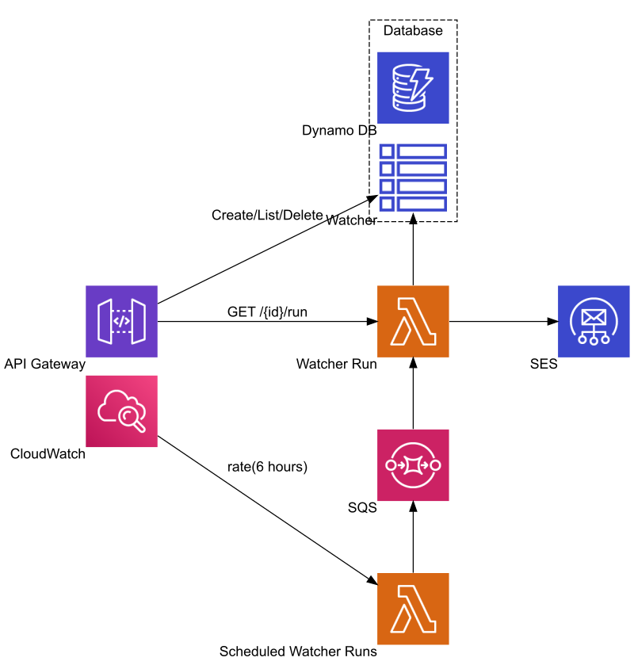

# Watcher [Serverless App]

A simple web page monitoring app sending e-mail alerts about changes to a page.

* AWS : API Gateway, Lambda, DynamoDB, CloudWatch, SQS, SES
* SAM + Swagger (OpenAPI)
* NodeJS 8.10
* REST API, Security: API KEY



## Prerequisites
* AWS Account
* AWS CLI
* SAM CLI
* Node JS 8.10
* (Optional) jq

## Deployment

1. Create S3 bucket for deployment

    ```BUCKET NAME``` is where the deployment artefacts are placed

    ``` shell
    aws s3api create-bucket --bucket [BUCKET NAME]
    ```

1. Upload Swagger (OpenAPI) file

    ``` shell
    aws s3 cp swagger.yaml s3://[BUCKET NAME]/
    ```

1. Build the project with SAM

    ``` shell
    sam build --build-dir ./dist --template sam.yaml
    ```

1. Package the project with SAM

    ``` shell
    sam package --s3-bucket [BUCKET NAME] --template-file dist/template.yaml --output-template-file dist/packaged.yaml
    ```

1. Deploy the project with CloudFormation

    ```RECIPIENT EMAIL ADDRESS``` is where the alert emails are sent about webpage content changes
    
    ```SENDER EMAIL ADDRESS``` will show up as the sender for the alert emails

    ``` shell
    aws cloudformation deploy --template-file dist/packaged.yaml \
        --stack-name WatcherAppStack \
        --s3-bucket [BUCKET NAME] \
        --capabilities CAPABILITY_NAMED_IAM \
        --parameter-overrides \
            "SwaggerLocation=s3://[BUCKET NAME]/swagger.yaml" \
            "SESRecipient=[RECIPIENT EMAIL ADDRESS]" \
            "SESSender=SENDER EMAIL ADDRESS"
    ```

    There are optional parameters you can change

    * ```EnvironmentParameter=dev|prod``` sets the environment for deployment
    * ```SESRegion=eu-west-1|us-east-1|us-west-2``` sets the region for sending e-mails with SES

1. Get the output from the deployment

    ``` shell
    aws cloudformation describe-stacks --stack-name WatcherAppStack | jq .Stacks[0].Outputs
    ```

    This command uses ```jq``` to extract the outputs from the JSON reponse.

1. Verify sender and recipient e-mail addresses in the AWS SES console

1. Create an API key for authentication

    ``` shell
    aws apigateway create-api-key --enabled --name [API KEY NAME]
    ```

1. Add the key to the usage plan

    ```PLAN ID``` can be found in the deployment output, look for the object with ```"OutputKey": "UsagePlanId"```

    ```API KEY ID``` look for the ```"id"``` value in the reponse from creating the API key

    ``` shell
    aws apigateway create-usage-plan-key --key-type "API_KEY" --usage-plan-id [PLAN ID] --key-id [API KEY ID]
    ```

## Remove Deployment

Remove the deployment (deleting stack) if the app is not needed anymore, or if something goes wrong during deployment that needs fixing before trying it again.

``` shell
aws cloudformation delete-stack --stack-name WatcherAppStack
```

## Test

1. Create a new watcher item

    ```API ROOT URL``` can be found in the deployment output, look for the object with  ```"OutputKey": "ApiRootUrl"```

    ```API KEY``` is the value of the ```"value"``` attribute from the response when the API key was created

    ``` shell
    curl -X POST [API ROOT URL]/watcher \
        -H "x-api-key:[API KEY]" \
        -H "Content-Type: application/json" \
        -d '{"location": "https://google.com/", "path": "//title/text()"}'
    ```

1. List the watcher items

    ``` shell
    curl -X GET [API ROOT URL]/watcher \
        -H "x-api-key:[API KEY]"
    ```

1. Run a watcher manually to check for changes

    ```WATCHER ID``` is the value of the ```"id"``` attribute of the watcher from the previous listing

    ``` shell
    curl -X GET [API ROOT URL]/watcher/[WATCHER ID]/run \
        -H "x-api-key:[API KEY]"
    ```

1. Delete the watcher

    ``` shell
    curl -X DELETE [API ROOT URL]/watcher/[WATCHER ID] \
        -H "x-api-key:[API KEY]"
    ```

    **NOTE**: The scheduled timer will run the watcher automatically in every 6 hours if you do not delete it
